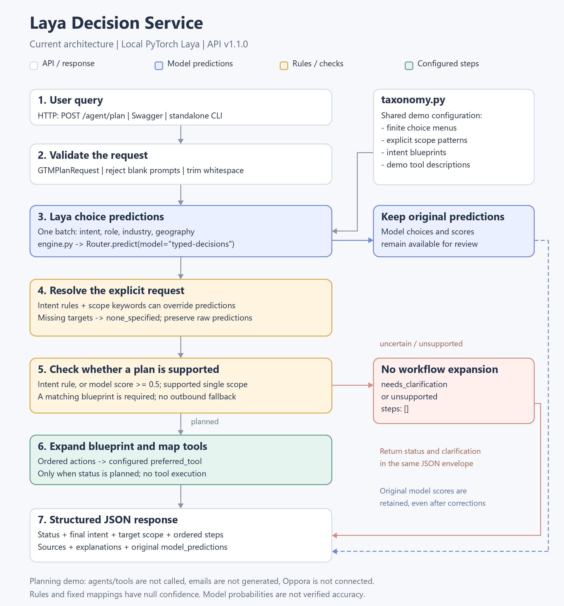

# Laya Decision Service: Architecture and Query Flow

**Audience:** team lead and engineers reviewing the standalone demo  
**Implementation:** API version 1.1.0; local PyTorch Laya, `typed-decisions` checkpoint

## 1. What this project demonstrates

The service converts a user request into a structured GTM workflow plan. It
identifies intent and target categories, applies explicit-request rules, chooses
a supported blueprint, and returns the actions and configured tool names as JSON.

It is a **hybrid planner: Laya predictions + Python rules + workflow templates**.
It does not execute tools, call other agents, generate emails, or update Oppora.
The model supplies choice predictions; Python supplies the final plan and its
explanation text. This implementation uses PyTorch rather than MLX.

## 2. Visual architecture



The image works without a Mermaid extension. Open [architecture.svg](architecture.svg)
for the scalable version. Keep both images beside this file when sharing the folder.

## 3. Follow one request through the service

| Stage | What happens | Where it happens |
| --- | --- | --- |
| Receive | Swagger, an HTTP client or the CLI supplies a prompt. The API validates and trims it; blank prompts are rejected. | `app.py`, `contracts.py`, `demo_client.py` |
| Predict | One Laya batch answers four choice questions: intent, role, industry and geography. Each question has a finite menu from the taxonomy. | `engine.py`, `taxonomy.py` |
| Preserve evidence | Original model choices and scores are retained as `model_predictions`. This lets reviewers distinguish the model from subsequent corrections. | `gtm_agent.py` |
| Resolve explicit requests | Simple text rules can override an intent. Scope patterns preserve recognized categories; absent targets become `none_specified`. | `requested_intent()` and `resolve_scope()` in `gtm_agent.py` |
| Check whether to plan | An intent without a rule match needs a model score of at least 0.5. Recognized unsupported or multiple scope categories require clarification. Missing blueprints return unsupported. | `gtm_agent.py` |
| Expand | A supported intent maps to an ordered blueprint. Contact searches omit verification unless email/verification is requested. | `WORKFLOW_BLUEPRINTS` in `taxonomy.py` |
| Map and return | Each action takes its blueprint's `preferred_tool`. Python adds descriptions and explanations; Pydantic validates the JSON response. | `gtm_agent.py`, `contracts.py` |

The 0.5 cutoff is a conservative demo guardrail, not a calibrated accuracy
threshold. It applies to the intent only when no explicit intent rule matched.
The service still calls Laya first even when a rule will later resolve the request.

## 4. How the planner agent works

`OpporaGTMAgent` is the Python coordinator. It calls the decision engine once for
the four predictions, applies rules and checks, then constructs a plan. It is
not a conversational LLM and does not autonomously execute the listed tools.

The explicit-intent rules currently check incoming-message classification,
outbound/outreach, enrichment, cleanup, people search and company search in that
order. This precedence supports the demo examples; it is not a general solver
for arbitrary mixed requests or complex negation.

Scope resolution is also limited: recognized single categories use text rules.
When no category is recognized, the field normally becomes `none_specified`; geography has an
additional location-phrase check for unsupported places. Distinct multiple
categories trigger clarification because the schema has one category per field.
The model's scope guesses remain visible in `model_predictions`.

### Supported workflows

| Intent | Ordered actions and configured demo tools |
| --- | --- |
| `account_discovery` | Discover companies -> `company_finder` |
| `contact_hunting` | Find decision makers -> `contact_hunter`; when email/verification is requested, verify contact data -> `verify_emails` |
| `outbound_pipeline` | Discover companies -> `company_finder`; find decision makers -> `contact_hunter`; verify contact data -> `verify_emails`; qualify leads -> `smart_lead_scoring` |
| `enrichment_only` | Enrich existing records -> `company_enrichment` |
| `crm_cleanup` | Verify contact data -> `verify_emails`; no deletion or full CRM cleanup executor is implemented |
| `inbound_triage` | Classify incoming replies -> `reply_ora`; no reply writing |

These are demo tool labels, not a complete or connected Oppora tool registry.
`campaign_sequencer` is in the catalog but no current blueprint uses it.

## 5. Two examples to explain to the lead

### Example A: companies

```json
{"prompt": "Find IT services companies in India"}
```

The final intent is `account_discovery`. The target is `it_services` in `india`,
with `role: none_specified`. The plan contains only `discover_companies` using
`company_finder`. No person search or outreach is added.

### Example B: people

```json
{"prompt": "Find VP of engineering in the USA"}
```

The final intent is `contact_hunting`. The target is `engineering_leaders` in
`us_nationwide`, with `industry: none_specified`. The plan contains only
`find_decision_makers` using `contact_hunter`. No industry is invented.

In the recorded verification, Laya itself selected `outbound_pipeline` for both
examples, while explicit rules corrected the final plans. Review the real
[sample responses](sample_responses.json) to see both layers. These successful
plans demonstrate the combined planner, not validated standalone model accuracy.

For `Find companies in Canada`, the small location catalog returns `other`,
`status: needs_clarification` and `steps: []`. The service does not substitute US
coverage. A missing intent blueprint similarly returns `unsupported` with no steps.

## 6. Understanding the JSON

| Field | Meaning |
| --- | --- |
| `status` | `planned`, `needs_clarification`, or `unsupported`. Only a planned response contains workflow steps. |
| `intent` | Final category, source, confidence/probabilities when available, and explanation. |
| `target_scope` | Final role, industry and geography, with a source and explanation for each. |
| `steps` | Ordered actions, configured tools and explanations. These are instructions for a future executor. |
| `model_predictions` | Original Laya outputs before explicit rules. |
| `clarification`, `warnings` | Why a request cannot currently be expanded into a plan. |
| `total_latency_ms` | Time spent building this plan; not tool-execution time or a P95 benchmark. |

`model_probability` means a model-provided winning-choice probability;
`model_score` means another model-provided score. Neither is verified accuracy.
`explicit_rule` and `fixed_mapping` have `confidence: null`, because no model
probability exists for that decision. `unavailable` also has a null score.
Reasoning strings are rule/template explanations, not model-generated reasoning.

## 7. API, startup and files

At startup, FastAPI loads the engine and warms up the model. Warmup failure
prevents startup. The engine and planner are reused within a server process.

| Entry point | Purpose |
| --- | --- |
| GET `/health` | Reports model and engine readiness. |
| POST `/decision` | Returns raw Laya choice answers; it does not apply planner corrections. |
| POST `/agent/plan` | Returns the combined workflow plan. |
| `demo_client.py` | Runs six requests directly through the Python planner; it does not call the HTTP API. |

| File | Responsibility |
| --- | --- |
| `app.py` | API routes and startup lifecycle. |
| `engine.py` | Laya Router, model warmup, inference timing and score parsing. |
| `gtm_agent.py` | Request coordination, rules, clarification checks and JSON construction. |
| `taxonomy.py` | Choice menus, scope patterns, tool descriptions and six blueprints. |
| `contracts.py` | Pydantic request and response schemas. |
| `test_regressions.py` | Ten regression checks with deliberately wrong model predictions; no inference. |
| `sample_responses.json` | Recorded real-model FastAPI responses for review. |
| `requirements.txt`, `README.md` | Dependencies, setup, demo commands and limitations. |

## 8. Where Oppora could integrate it later

The UI and AI Admin assessment identified bounded decision opportunities:
Ask Ora specialist routing, Finder mode/source selection, semantic lead fit,
company/domain evidence matching and workflow branching.

The intended future execution loop would be:

```text
Oppora request + current task state + permitted choices
    -> decision service
    -> validate the selected route/action in Oppora code
    -> call the actual agent or tool
    -> collect its result and update task state
    -> make the next decision, or finish
```

This loop is proposed; it is not implemented here. Laya makes a bounded decision,
while Oppora's orchestrator calls agents/tools and controls the sequence. The
current demo's six GTM intents are different from Oppora's seven specialist
routes: Finder, Campaign, CRM, Research, Analytics, Workflow and Direct.

Production integration needs the real registry, conversation/task state and
representative evaluation examples. The accepted `context` field is currently
unused. Generative LLMs remain appropriate for writing and research synthesis.
Exact filters and execution permissions belong in application code.

## 9. A short explanation for the demo

> "This service takes a request and returns a structured workflow plan. Laya
> predicts categories; simple rules preserve explicit requests, and templates
> define the steps and tools. Original model scores remain visible. The service
> plans the work without executing it. We can later evaluate the same decision
> boundary for selected routing and workflow choices inside Oppora."

Show the two examples above in Swagger, then inspect `status`, `intent`,
`target_scope`, `steps` and `model_predictions`. After restarting, Swagger should
show API version **1.1.0**. See the README for commands.

The previous verification passed ten regression checks and seven planned
real-model FastAPI cases, plus API/schema and clarification checks. It establishes
the observed demo behaviour, not production accuracy, latency or cost savings.

When sharing the code, include this document, its PNG/SVG, the Python files,
requirements, README and sample JSON. The lead can recreate the virtual
environment; the existing `venv` and downloaded weights are not needed in the
source handoff.
